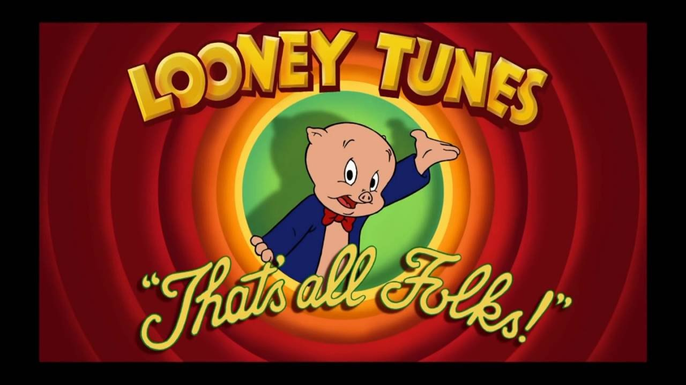

import './scripts.js';
export { default as theme } from './theme';
import { Appear } from 'mdx-deck';
import { Head, Image } from 'mdx-deck';
import { Split } from 'mdx-deck/layouts';
import nightOwl from 'prism-react-renderer/themes/nightOwl';
import { CodeSurfer } from 'mdx-deck-code-surfer';
import { Code } from './components/code';
import { CodeSurferNoZoom } from './components/code-surfer-no-zoom';
import { ReadMore } from './components/read-more';

<Head>
  <title>Better React With Hooks - AUHack 2019</title>
</Head>

# Better React With Hooks

### AUHack 2019

by Jeppe Reinhold [@DrReinhold](https://twitter.com/drreinhold) and Gustav Wengel [@GeeWengel](https://twitter.com/geewengel)

---

# Introduction

## Part 1

---

<ul style={{ fontSize: '1.5em' }}>
  <li>We are Jeppe 🙋‍♂️ and Gustav 🙋‍♂️</li>
  <Appear>
    <li>
      We've done web development and specifically React development for over
      three years
    </li>
    <li>
      Now we build cool apps at <a href="https://reccoon.dk">Reccoon</a> in
      Hatch IT Lab
    </li>
  </Appear>
</ul>

---

# Agenda

<ol style={{ fontSize: '1.3em' }}>
  <Appear>
    <li>Introduction</li>
    <li>What are hooks</li>
    <li>Our first hook: useState</li>
    <li>
      <code>useState exercises!</code>
    </li>
    <li>Why hooks make React better</li>
    <li>Our second hook: useEffect</li>
    <li>
      <code>useEffect exercises!</code>
    </li>
  </Appear>
</ol>

---

# What are hooks

## Part 2

---

## Built in functions we can use to make complex logic simple

<ul style={{ fontSize: '1.3em' }}>
  <Appear>
    <li>
      <code>useState</code>: state in functional components (no classes!)
    </li>
    <li>
      <code>useEffect</code>: apply effects when other things changes
    </li>
    <li>
      <code>useRef</code>
    </li>
    <li>
      <code>useCallback</code>
    </li>
    <li>
      <code>...</code>
    </li>
  </Appear>
</ul>

---

<CodeSurferNoZoom
  code={require('!raw-loader!./examples/what-are-hooks.js')}
  lang="jsx"
  showNumbers={true}
  theme={nightOwl}
  steps={[{}]}
/>

---

# Our first hook: `useState`

### Part 3

---

<CodeSurferNoZoom
  code={require('!raw-loader!./examples/use-state.js')}
  lang="jsx"
  showNumbers={true}
  theme={nightOwl}
  steps={[{}]}
/>

---

---

# Why hooks?

## Which problems are hooks solving?

### Part 4

---

<ul style={{ fontSize: '1.3em' }}>
  <li>
    Hooks make it possible to <em>organize logic</em> in components, making them{' '}
    <em>tiny and reusable without writing a class.</em>
  </li>
  <Appear>
    <li>
      Reusable logic has historically been achieved with{' '}
      <em>Render Props or HOCs</em>, that introduce unnecessary component
      nesting and complications
    </li>
    <li>
      Complex behavior in component has required classes - which are often{' '}
      <em>harder to understand than regular functions</em>
    </li>
    <li>When will my class mount?</li>
    <li>What happens when it updates?</li>
    <li>What happens when I change this instance variable?</li>
  </Appear>
</ul>

---

# Our second hook: `useEffect`

### Part 5

---

<CodeSurferNoZoom
  code={require('!raw-loader!./examples/use-effect.js')}
  lang="jsx"
  showNumbers={true}
  theme={nightOwl}
  steps={[{}]}
/>

---

<ul style={{ fontSize: '1.3em' }}>
  <li>Do stuff when something changes</li>
  <Appear>
    <li>
      Ie. apply an <em>effect</em> when a specific variable <em>changes</em>
    </li>
    <li>
      <code>useEffect</code> is a replacement for our component life cycle hooks
      - <code>didMount</code>, <code>didUpdate</code>, <code>willUnmount</code>
      ...
    </li>
    <li>
      It is a drastically new way of thinking -{' '}
      <em>your component doesn't have a life cycle anymore!</em>
    </li>
    <li>
      We do not think in "start", "update" and "end" - just "if this happens,
      run this effect"
    </li>
  </Appear>
</ul>

---

---

export default Split;

  🙋‍♂️
  <a href="https://twitter.com/drreinhold" target="_blank" className="link">
    @DrReinhold
  </a>
  <a href="mailto:jeppe@bambuu.dk" target="_blank" className="link">
    jeppe@bambuu.dk
  </a>

  🙋‍♂️
  <a href="https://twitter.com/geewengel" target="_blank" className="link">
    @GeeWengel
  </a>
  <a href="mailto:gustav@bambuu.dk" target="_blank" className="link">
    gustav@bambuu.dk
  </a>

---

